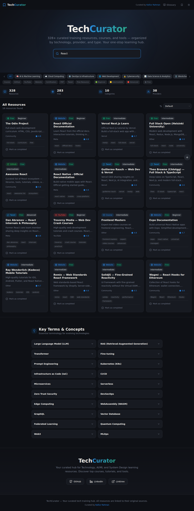
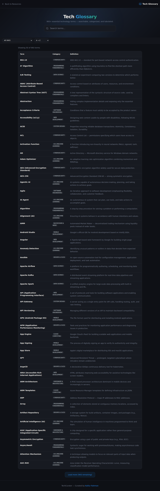

# TechCurator

**TechCurator** is a comprehensive, curated hub for technology learning resources. Whether you are a beginner looking to start your journey in tech or an experienced developer aiming to master advanced concepts, TechCurator provides a structured collection of courses, tutorials, and tools organized by category, difficulty, and type.


## 🚀 Features

-   **Extensive Resource Library**: Over 200+ curated learning resources covering AI/ML, Cloud Computing, DevOps, Web Development, Cybersecurity, and more.
-   **Advanced Filtering & Search**: Rapidly find what you need. Filter resources by category, type (Course, GitHub, YouTube, etc.), difficulty level, and cost (Free/Paid). The integrated search interaction allows instant lookups.
-   **Tech Glossary**: A dedicated glossary section defining essential tech terms and concepts to help beginners build a foundational vocabulary.
-   **Progress Tracking**: Mark resources as completed to track your learning journey over time.
-   **Bookmarking**: Save your favorite resources for quick access whenever you need them.
-   **Learning Paths**: Structured paths to guide you through specific domains from start to finish.
-   **Dark/Light Mode**: Seamlessly toggle between themes for comfortable reading in any environment.
-   **Responsive Design**: A clean, modern interface fully optimized for desktop, tablet, and mobile devices.

## 📸 Screenshots

Here is a closer look at the application's key views and interactions:

### Home & Resource Library
The main dashboard where you can explore, filter, and discover the extensive collection of tech resources. Note: The library features are fully integrated into the home page for a seamless browsing experience.


### Search & Filtering Interaction
A powerful and instant search capability combined with category and difficulty filters to drill down into exactly the type of content you want.


### Glossary Page
A comprehensive alphabetical list of technical terms, acronyms, and definitions designed to demystify complex jargon.


## 🛠️ Tech Stack

This project is built with modern web technologies prioritizing performance, accessibility, and developer experience:

-   **[Vite](https://vitejs.dev/)**: Next Generation Frontend Tooling ensuring lightning-fast HMR and optimized builds.
-   **[React](https://reactjs.org/)**: A declarative, efficient JavaScript library for building user interfaces.
-   **[TypeScript](https://www.typescriptlang.org/)**: Strongly typed JavaScript to improve code quality and maintainability.
-   **[Tailwind CSS](https://tailwindcss.com/)**: A utility-first CSS framework for rapid and responsive UI development.
-   **[shadcn/ui](https://ui.shadcn.com/)**: Beautifully designed, accessible, and customizable components built using Radix UI and Tailwind CSS.
-   **[Lucide React](https://lucide.dev/)**: Beautiful & consistent iconography.
-   **[Framer Motion](https://www.framer.com/motion/)**: A production-ready motion library powering smooth animations and transitions in React.

## 🏁 Getting Started

Follow these instructions to get a copy of the project up and running on your local machine for development and testing.

### Prerequisites

-   **Node.js**: Ensure you have Node.js installed (v18 or higher recommended).
-   **npm**: The Node package manager (usually installed alongside Node.js).

### Installation

1.  **Clone the repository**
    ```bash
    git clone https://github.com/kalilurrahman/tech-curator.git
    cd tech-curator
    ```

2.  **Install dependencies**
    ```bash
    npm install
    ```

3.  **Start the development server**
    ```bash
    npm run dev
    ```

4.  **Open in browser**
    Visit `http://localhost:8080` to view the application.

## 📂 Project Structure

Here is a brief overview of the project's architecture and organization:

```
├── public/              # Static assets (images, icons, updated screenshots)
├── src/
│   ├── components/      # Reusable UI components (including shadcn/ui)
│   ├── data/            # Static data files (resources, learning paths, glossary)
│   ├── hooks/           # Custom React hooks for state and lifecycle management
│   ├── lib/             # Utility functions and shared configurations
│   ├── pages/           # Application route pages (Home/Index, Glossary, NotFound)
│   ├── test/            # Test files (Vitest / React Testing Library)
│   ├── App.tsx          # Main application component & router setup
│   └── main.tsx         # Application entry point
├── .gitignore           # Git ignore configurations
├── package.json         # Project dependencies, metadata, and scripts
├── tailwind.config.ts   # Tailwind CSS configuration and theming
├── tsconfig.json        # TypeScript compiler configurations
└── vite.config.ts       # Vite bundler configuration
```

## 🤝 Contributing

Contributions are highly welcome! If you have suggestions for new resources, UI improvements, or bug fixes, please feel free to submit a Pull Request.

1.  Fork the repository.
2.  Create your feature branch (`git checkout -b feature/AmazingFeature`).
3.  Commit your changes (`git commit -m 'Add some AmazingFeature'`).
4.  Push to the branch (`git push origin feature/AmazingFeature`).
5.  Open a Pull Request describing your changes.

## 📝 License

This project is licensed under the MIT License - see the LICENSE file for details.

## 🙏 Credits

Curated and maintained by [Kalilur Rahman](https://linktr.ee/kalilur.rahman).
